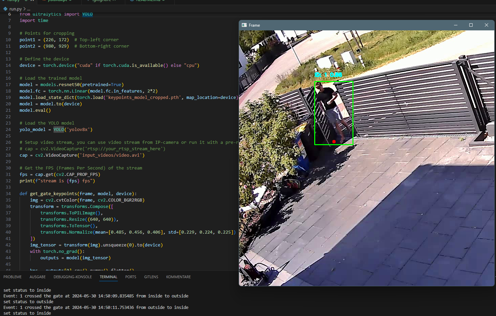
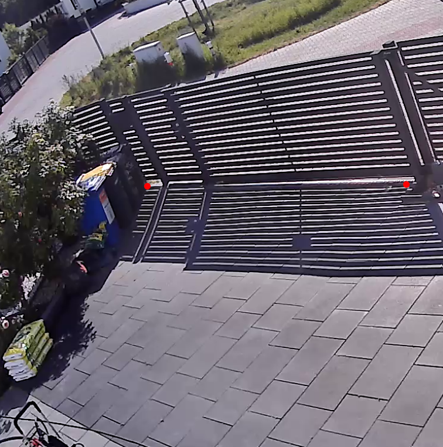

# Real-Time Person Tracking and Gate-Crossing Detection

This project is a real-time person tracking and gate-crossing detection system that uses the YOLOv8 (You Only Look Once) model for object detection and a modified ResNet-50 model for keypoint detection of the gate region of my property, but  you can modify it to work on your gate region. The crossing of the gate is being detected. The application is designed to run on videos streamed from an IP camera or pre-recorded video files.

## Project Structure

- **Main Dependencies**: OpenCV, PyTorch, torchvision, ultralytics (YOLO)
- **Main Functionality**:
  - Detects and tracks persons in a video stream and assignes them ID's
  - Extracts keypoints to define a gate region in the frame.
  - Monitors and logs when a person crosses the gate, specifying whether they entered or exited.

## Setup

To set up and run this project, follow these steps:

1. **Install Required Libraries**:
   ```bash
   pip install -r requirements.txt

2. **Capture Frames**:
   - save them into a folder

3. **Label Frames for Keypoint Detection**:
   - use a tool like labelstudio.com

4. **Train Keypoint Detection model**:
   - use area_keypoints_training.ipynb
   - export the model

5. **Combine with YOLO and run inference**:
   - download your YOLO model file and add it to the directory
   - set up your video stream
   - use run.py


## Screenshots

I passed through the gate from inside to outside, and then re-entered about three seconds later. The movement was detected and the console displayed the matching output.



The keypoints of the gate are displayed here.

